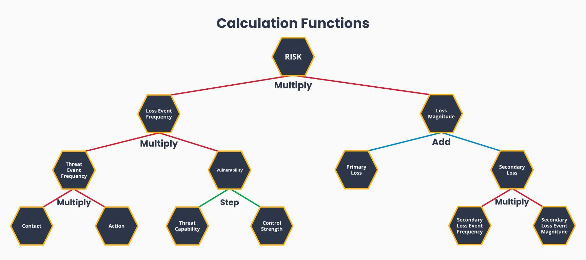

Generally
=========

Overview
--------

If you are already familiar with FAIR, please skip to `Getting Started
With pyfair`_.

`Factor Analysis for Information Risk (FAIR)
<https://en.wikipedia.org/wiki/Factor_analysis_of_information_risk>`_
is a methodology for analyzing cybersecurity risk. In a general sense, it
works by breaking risk into its individual components. These components can
then be measured or estimated numerically, allowing for a quantitative 
calculation of risk as a whole.

.. note::

    "Risk" in FAIR is defined as the total dollar amount of expected loss
    for a given time frame. If you come from a traditional risk management
    background, you likely refer to this as the more commonly accepted term
    "Loss Exposure". This documentation will use the FAIR nomenclature.

The actual calculation for Risk often takes the form of a `Monte Carlo
method <https://en.wikipedia.org/wiki/Monte_Carlo_method>`_. This Monte
Carlo method supplies random inputs for our model. The model then
transforms the inputs in accordance with FAIR calculation rules, and 
provides outputs. The outputs can then be analyzed to determine what the 
potential range of Risk values are. pyfair's purpose is to simplify and 
automate these Monte Carlo methods.

A Quick Monte Carlo Example
---------------------------

Generally speaking, Monte Carlo experiments are a class of techniques that 
solve problems using random sampling. Within the context of FAIR they are
used to estimate loss by performing calculations on random inputs. This is
a brief demonstration of how you can use a Monte Carlo method without
knowing anything about FAIR.

Say we know the average height and average weight a certain population
looks like, but we don't know what the average `Body Mass Index (BMI)
<https://en.wikipedia.org/wiki/Body_mass_index>`_ looks like:

.. image:: ./_static/before_monte_carlo_bmi.png

We can use the weight and height distributions from the data we do know to 
randomly generate 3 height samples and 3 weights samples.

+--------+-------------+-------------+
| Sample | Weight (kg) | Height (cm) |
+========+=============+=============+
| 1      | 41          | 107         |
+--------+-------------+-------------+
| 2      | 52          | 139         |
+--------+-------------+-------------+
| 3      | 85          | 131         |
+--------+-------------+-------------+ 

We take these generated samples, and for each For each of these samples, 
we calculate the samples' BMI using the following formula:

.. math::

    \text{BMI} = \frac
            {\text{Weight}_{kg}}
            {(\text{Height}_{cm} \times .01) ^2}

+--------+-------------+-------------+-----+
| Sample | Weight (kg) | Height (cm) | BMI |
+========+=============+=============+=====+
| 1      | 41          | 107         | 36  |
+--------+-------------+-------------+-----+
| 2      | 52          | 139         | 27  |
+--------+-------------+-------------+-----+
| 3      | 85          | 131         | 50  |
+--------+-------------+-------------+-----+ 

Once we have these BMIs, we can calculate the mean and spread of these
BMIs. With 3 samples, this doesn't give us a lot of data, but if we were to 
run 10,000 or so samples, we would get a distribution like this:

.. image:: ./_static/after_monte_carlo_bmi.png

Most Monte Carlo simulations follow a similar process. We generate random
inputs in accordance with a particular distribution, and we then run these
inputs through complex or arbitrary formulae we cannot analyze otherwise. 
The output can then be used to infer what an expected output population
looks like.

Nodes
-----

Risk in FAIR (and by extension Risk in our Monte Carlo simulation) is
broken down into a series of what pyfair calls "nodes" for calculation.
The user supplies two or more of these nodes to generate random data, which
in turn will allow us to calculate the mean, max, min, and standard
deviation of the Risk and other nodes.

.. note::

    While we refer to the data in these nodes, it is important to remember
    that we are talking about a single simulation within the Monte Carlo
    model. For example, if we have 1,000 simulations, we will have a 
    `vector <https://en.wikipedia.org/wiki/Row_and_column_vectors>` of
    1,000 elements. This will become more clear in the  `FAIR by Example`_ 
    section.

The nodes are as follows:

The nodes can be described as follows:

#. **Risk ("R")**

    Description: a vector of currency values/elements, which represent the
    ultimate loss for a given time period

    Restrictions: all elements must be positive

    Derivation: multiply the Loss Event Frequency vector by the Loss
    Magnitude vector

    .. math::

        \begin{bmatrix}
            \text{R}_{1} \\
            \text{R}_{2} \\
            \vdots \\
            \text{R}_{m}
        \end{bmatrix}
        =
        \begin{bmatrix}
            \text{LEF}_{1} \\
            \text{LEF}_{2} \\
            \vdots \\
            \text{LEF}_{m}
        \end{bmatrix}
        \times
        \begin{bmatrix}
            \text{LM}_{1} \\
            \text{LM}_{2} \\
            \vdots \\
            \text{LM}_{m}
        \end{bmatrix}

    
    Example: For a given year the following dollar amounts:

    .. math::

        \begin{bmatrix}
            \text{\$1,500,000} \\
            \text{\$0} \\
            \vdots \\
            \text{\$527,000} \\
        \end{bmatrix}

#. **Loss Event Frequency ("LEF")**

    Description: a vector of elements which represent the number of times a 
    particular loss occurs during a given time frame (generally one year)

    Restrictions: all elements must be positive

    Derivation: supplied directly, or multiply the Threat Event Frequency 
    vector by the Vulnerability vector

    .. math::

        \begin{bmatrix}
            \text{LEF}_{1} \\
            \text{LEF}_{2} \\
            \vdots \\
            \text{LEF}_{m}
        \end{bmatrix}
        =
        \begin{bmatrix}
            \text{TEF}_{1} \\
            \text{TEF}_{2} \\
            \vdots \\
            \text{TEF}_{m}
        \end{bmatrix}
        \times
        \begin{bmatrix}
            \text{V}_{1} \\
            \text{V}_{2} \\
            \vdots \\
            \text{V}_{m}
        \end{bmatrix}

    Example: Count of breaches resulting in data loss (for given year):

    .. math::

        \begin{bmatrix}
            \text{5} \\
            \text{1} \\
            \vdots \\
            \text{10} \\
        \end{bmatrix}

#. **Threat Event Frequency ("TEF")**

    Description: a vector of elements representing the number of times a 
    particular threat occurs, whether or not it results in a loss

    Restrictions: all elements must be positive

    Derivation: supplied directly, or multiply the Contact Frequency vector
    and the Probability of Action vector

    .. math::

        \begin{bmatrix}
            \text{TEF}_{1} \\
            \text{TEF}_{2} \\
            \vdots \\
            \text{TEF}_{m}
        \end{bmatrix}
        =
        \begin{bmatrix}
            \text{C}_{1} \\
            \text{C}_{2} \\
            \vdots \\
            \text{C}_{m}
        \end{bmatrix}
        \times
        \begin{bmatrix}
            \text{A}_{1} \\
            \text{A}_{2} \\
            \vdots \\
            \text{A}_{m}
        \end{bmatrix}

    Example: Count of cross-site scripting attempts in a given month

    .. math::

        \begin{bmatrix}
           \text{9,400} \\
           \text{8,010} \\
           \vdots \\
           \text{8,200} \\
        \end{bmatrix}

#. **Vulnerability ("V")**

    Description: a vector of elements with each value representing the
    probability that a potential threat actually results in a loss

    Restrictions: all elements must be between zero and one

    Derivation: supplied directly, or via the following operation:
    
    .. math::

        \bar{V}
        \;
        \text{Where}
        \;
        V_{i}
        =
        \begin{cases}
            1, & \text{if} \; \text{TC}_{i} \; \geq \text{CS}_{i}\\
            0, & \text{if} \; \text{TC}_{i} \; \lt \text{CS}_{i}\\
        \end{cases}

    Or in other words:

    For each simulation, see if Threat Capability is greater than Control
    Strength. If TC is greater than CS, that simulation's value is 1.
    Otherwise it is zero. After this vector of zeros and ones is created,
    take the average of that vector. This number will be between zero and 
    one, and will represent the percentage of the population in which TC 
    was greater than CS (and by extension, which percentage of the
    population we can expect to be vulnerable).

    For example, say we have TCs:

    .. math::

        \begin{bmatrix}
           0.60 \\
           0.70 \\
           0.10 \\
        \end{bmatrix}
    
    And we have CSes:

    .. math::

        \begin{bmatrix}
           0.55 \\
           0.65 \\
           0.75 \\
        \end{bmatrix}

    For item one, TC is .60 and CS is .55. and consequently our resulting
    first item will be 1 (because it's vulnerable) For item two, TC is .70
    and CS is .65, and consequently our resulting second item will be 1
    (because it's vulnerable). For item 3, our TC is .10 and our CS is .75,
    and consequently our resulting third item will be zero (because it's
    not vulnerable. The resulting matrix will be:

    .. math:

        \begin{bmatrix}
           1 \\
           1 \\
           0 \\
        \end{bmatrix}

    The average of this matrix is:

    .. math:

        \frac
            {(1 + 1 + 0)}
            {3}
        =
        .66
    
    Which in turn means our Vulnerability vector will be a lot like a
    scalar value:

    .. math:

        \begin{bmatrix}
           .66 \\
           .66 \\
           .66 \\
        \end{bmatrix}

    Example: the percentage of phishing attempts that result in loss

    .. math::

        \begin{bmatrix}
           0.76 \\
           0.89 \\
           \vdots \\
           0.72 \\
        \end{bmatrix}

#. **Contact Frequency ("C")**

    Description: the number of threat actor contacts that could potentially 
    yield a threat within a given timeframe

    Restrictions: must be a positive number

    Derivation: None (this must be supplied, not calculated)

    Example: 20,000 (scans of a vulnerable port within a given year)

#. **Probability of Action ("A")**

    Description: the probability that a threat actor will proceed when
    coming upon a given 

    Restrictions: must be number from 0.0 to 1.0

    Derivation: None (this must be supplied, not calculated)

    Example: .45 (percent that actor will proceed with potential SSH login)

#. **Threat Capability ("TC")**

    Description: a unitless number that describes the relative level of
    expertise and resources of a threat actor

    Restrictions: must be a number from 0.0 to 1.0

    Derivation: None (this must be supplied, not calculated)

    Example: .25 (unitless)

#. **Control Strength ("CS")**

    Description: a unitless number that describes the relative strength of
    the control environment a threat actor is trying to exploit

    Restrictions: must be a number from 0.0 to 1.0

    Derivation: None (this must be supplied, not calculated)

    Example: .40 (unitless)

#. **Loss Magnitude ("LM")**

    Description: the total loss for a given Loss Event

    Restrictions: must be positive

    Derivation: supplied directly, or the sum of the Primary Loss and
    Secondary Loss

    Example: 10,000,000 (dollars for each database breach)

#. **Primary Loss ("PL")**

    Description: the amount of the loss directly attributable to the threat

    Restrictions: must be a positive number

    Derivation: None (this must be supplied, not calculated)

    Example: 25,000,000 (dollars in funds stolen)

#. **Secondary Loss ("SL")**

    Description: the amount of loss incurred as a secondary consequence of
    the loss

    Restrictions: must be a positive number

    Derivation: supplied directly, or the aggregate sum of the Secondary
    Loss Event Frequency and Secondary Loss Event Magnitude vectors
    multiplied together

    Example: 5,000,000 (dollars worth of data research/cleanup post-breach)

#. **Secondary Loss Event Frequency ("SLEF")**

    Description: the probability that a given secondary loss could occur

    Restrictions: must be a vector of numbers from 0.0 to 1.0

    Derivation: None (this must be supplied, not calculated)

    Example: [.25, .80, 1.0] (probabilities of loss for 3 loss types)

#. **Secondary Loss Event Magnitude ("SLEM")**

    Description: the amount of the secondary loss that could occur

    Restrictions: must be a vector of positive numbers

    Derivation: None (this must be supplied, not calculated)

    Example: [100, 900, 200] (magnitude of loss for 3 loss types)

.. note::

    As implemented by pyfair, Secondary Loss is an aggregate field that is
    create using a vectors of values. This is an exception to the single
    value per simulation condition we discussed earlier.

Relationships and Dependencies
------------------------------

One of the benefits of FAIR is the flexibility that comes with being able
to pick and choose the data you supply. If you want to supply Loss Event
Frequency, and Loss Magnitude, you can do that.

.. image:: ./_static/lef_and_lm_example.png

If you want to supply Threat Event Frequency, Threat Capability, Control
Strength, Primary Loss, and Secondary Loss, you can do that to.

.. image:: ./_static/tef_tc_cs_pl_and_sl_example.png

As you can likely see from the above examples, you only need to supply the
bare minimum to complete the calculation. The general rule with pyfair is
that to properly calculate any node, the node's child nodes need to either
be calculable or supplied.

FAIR by Example
---------------

This is a quick example of how one might conduct a FAIR calculation by
hand. You will likely never need to do this, but it does provide a concrete
example of how everything works.

For the purposes of this demonstration, we will keep it simple. We will run
a Monte Carlo model composed of three separate simulations and using three
inputs. These inputs will be Threat Event Frqeuency (TEF), Vulnerability
(V), and Loss Magnitude (LM). We will use this simulation to estimate the 
Risk associated with allowing all ports to remain open.

The general approach will be as follows:

.. image:: ./_static/fair_by_example_with_numbers.png

* Step 1: Generate random values to supply TEF, V, and LM
* Step 2: Multiply your TEF and V values to calculate LEF
* Step 3: Multiply your LEF and LM to calculate Risk
* Step 4: Analyze your Risk outputs

Step 1: Generate Our Random Inputs
~~~~~~~~~~~~~~~~~~~~~~~~~~~~~~~~~~

We start by generating our data. We will generate 3 values for Threat Event
Frequency (TEF), 3 values for Vulnerability (V), and 3 values for Loss
Magnitude (LM). Most often in FAIR you will see BetaPert distributed random
variates. For the sake of simplicity this example will use normally
distributed random variates.

First we will estimate TEF. Recall that TEF is the number of threats that
occur whether or not it result in a loss (which is represented by a
positive number). Here we estimate that if leave these ports open, we will 
see around 50,000 attempted intrusions with a standard deviation of 10,000
events. We will then generate three normally distributed random numbers 
from a curve with a mean of 50,000 and a standard deviation of 10,000.

+------------+--------------------+
| Mean       | Standard Deviation |
+============+====================+
| 50,000     | 10,000             |
+------------+--------------------+

**Generates random TEF values**

+------------+--------+
| Simulation | TEF    |
+============+========+
| 1          | 53,091 |
+------------+--------+
| 2          | 38,759 |
+------------+--------+
| 3          | 44,665 |
+------------+--------+ 

Second we will estimate our Vulnerability. Recall that V is the probability
of whether a loss occurs.

**Generates random V values**

+------------+-----+
| Simulation | V   |
+============+=====+
| 1          | .66 |
+------------+-----+
| 2          | .52 |
+------------+-----+
| 3          | .68 |
+------------+-----+ 

Third we will estimate our loss magnitude. Recall that LM is the amount of
loss for each Loss Event (represented by a positive number). We estimate 
that on average each loss will result in an average of a $100 loss, with a
standard deviation of $50. We then generate three normally distributed
random numbers from a curve with a mean of 100 and a standard deviation
of 50.

+------+--------------------+
| Mean | Standard Deviation |
+======+====================+
| 100  | 50                 |
+------+--------------------+

**Generates random LM values**

+------------+-----+
| Simulation | LM  |
+============+=====+
| 1          | 198 |
+------------+-----+
| 2          | 150 |
+------------+-----+
| 3          | 86  |
+------------+-----+ 

Step 2: Calculate LEF Using TDF and V
~~~~~~~~~~~~~~~~~~~~~~~~~~~~~~~~~~~~~

As you can likely see, we can use our 3 TEFs and 3 Vs and multiply them
together element-by-element. This will give us 3 LEF values. 

+------------+--------+---+-------------------+
| Simulation | TEF    | V | LEF (TEF times V) |
+============+========+===+===================+
| 1          | 53,091 | 1 | 53,091            |
+------------+--------+---+-------------------+
| 2          | 38,759 | 0 | 0                 |
+------------+--------+---+-------------------+
| 3          | 44,665 | 1 | 44,665            |
+------------+--------+---+-------------------+

This follows with what we known know about Loss Event Frequency. It is the
amount of loss that actually occurs. We have a three potential losses, and
two of those losses actually occur. The others do not occur, so the amount
of loss is zero.

Step 3: Calculate Our R Using LEF and LM
~~~~~~~~~~~~~~~~~~~~~~~~~~~~~~~~~~~~~~~~

Now that we have an LEF and an LM, we can calculate our final Risk, R. R is
calculated by taking the total number of loss events and multiplying them
by the amount lost for each event.

+------------+--------+-----+------------------+
| Simulation | LEF    | LM  | R (LEF times LM) |
+============+========+=====+==================+
| 1          | 53,091 | 198 | 10,512,018       |
+------------+--------+-----+------------------+
| 2          | 0      | 150 | 0                |
+------------+--------+-----+------------------+
| 3          | 44,665 | 86  | 3,841,190        |
+------------+--------+-----+------------------+

Step 4: Analyze Our Risk Outputs
~~~~~~~~~~~~~~~~~~~~~~~~~~~~~~~~

By using our random inputs and putting them through our Monte Carlo model
we were able to calculate Risk for three simulations. The resulting Risk
from these simulations is $10,512,018, $0, and $4,841,190. Now that we have
conducted our simulation we've learned that with our estimates we can
expect our Risk to have the following attributes:

+------------+-------------------------+
| Risk Mean  | Risk Standard Deviation |
+============+=========================+
| $4,784,402 | $5,319,104              |
+------------+-------------------------+

pyfair, as you will see later on, makes this considerably easier. You
should be able to achieve similar results with 5 to 10 lines of code.

.. code-block:: python

    from pyfair import FairModel

    # Create our model and calculate (don't worry about understanding yet)
    model = FairModel(name='Sample')
    model.input_data('Threat Event Frequency', mean=50_000, stdev=10_000)
    model.input_data('Vulerability', p=.66)
    model.input_data('Loss Magnitude', mean=100, stdev=50)
    model.calculate_all()

.. image:: ./_static/calculation_example.png

Getting Started With pyfair
===========================

Usage
-----

This section relates to how to use pyfair.

In general you will supply your inputs, calculate your model, and then do
something with the data (e.g. store it, create a report, or feed it into
another calcluation).

Here is how you can use these pyfair tools to do that.

FairModel
~~~~~~~~~

The most basic element of PyFair is the FairModel. This
FairModel is used to create basic Monte Carlo simulations as follows:

.. code-block:: python

    from pyfair import FairModel

    # Create our model
    model = FairModel(name='Basic Model', n_simulations=10_000)

    # Add normally distributed data
    model.input_data('Loss Event Frequency', mean=.3, stdev=.1)

    # Add constant data
    model.input_data('Loss Magnitude', constant=5_000_000)

    # We could hypothetically do BetaPert data
    # model.input_data('Loss Magnitude', low=0, mode=10, high=100, gamma=90)

    # Run our simulations
    model.calculate_all()

    # Export results (if desired)
    results = model.export_results()

To reiterate what we did: first, we created a model object for us to use 
with a name of "Basic Model" and composed of 10,000 simulations. We then
supplied the "Loss Event Frequency" node with 10,000 normally distributed
random data values, and provided 10,000 entries into "Loss Magnitude" of
5,000,000. We then run the calculations for the simulation by running
calculate_all(), after which we can export the results or examine the
object however we wish.

.. note::

    pyfair uses pandas heavily for data manipulation, and consequently your 
    results will be exported as easy-to-manipulate DataFrames unless 
    otherwise specified.

While there are various ways to create these models (from serialized JSON
models, from a database, uploading groups of parameters at the same time)
... the general approach will almost always be the same. You will create 
the model, you will input your data, and you will calculate your model 
before using the results.

pyfair will take care of most of the "under the hood" unpleasantness
associated with the Monte Carlo generation and FAIR calculation. You simply
supply the targets and the distribution types. These targets are:

    * BetaPert: low, mode, and high (and optionally gamma)
    * Bernoulli/Binomial: p
    * Normal: mean, stdev

.. warning::

    You cannot mix these parameters. If you give a function a "constant"
    parameter, a "low" parameter, and a "mean" parameter, it will throw an
    error.

If you don't supply the right nodes to create a proper calculation, pyfair
will tell you what you're missing. If you don't supply the right arguments,
pyfair will tell you. Et cetera, et cetera, et cetera.

FairMetaModel
~~~~~~~~~~~~~

At times you will likely want to determine what the total amount of risk is
for a number of FairModels. Rolling these model risks up into a single unit
is what the FairMetaModel does. These can be created in a number of ways,
but most generally you will simply feed a list of FairModels to a 
FairMetaModel constructor like this:

.. code-block:: python

    from pyfair import FairModel, FairMetaModel

    # Create a model
    model1 = FairModel(name='Risk Type 1', n_simulations=10_000)
    model1.input_data('Loss Event Frequency', mean=.3, stdev=.1)
    model1.input_data('Loss Magnitude', constant=5_000_000)

    # Create another model
    model2 = FairModel(name='Risk Type 2', n_simulations=10_000)
    model2.input_data('Loss Event Frequency', mean=.3, stdev=.1)
    model2.input_data('Loss Magnitude', low=0, mode=10_000_000, high=20_000_000)

    # Create our metamodel
    metamodel = FairMetaModel(name='Our MetaModel', models=[model1, model2])

    # Calclate our MetaModel (and contained Models)
    metamodel.calculate_all()

    # Export results
    metamodel.export_results()

Again, the general workflow is the same. We create our metamodel, we
calculate our data, and we export the results.

FairModelFactory
~~~~~~~~~~~~~~~~

Related to the metamodel is the FairModelFactory object. Often you will
want to create a group of models that are identical except for one or two 
minor differences. For example, if you want to create a model for an entire
threat community, you may wish to create a model for "Threat Group 1", 
"Threat Group 2", and "Threat Group 3" before aggregating the risk into a 
single metamodel. FairModelFactory allows this by taking the parameters
that will not change, and then putting in a list of the parameters that
will change. An example is below:

.. code-block:: python

    from pyfair import FairMetaModel, FairModelFactory

    # Instantiate factory
    factory = FairModelFactory({'Loss Magnitude': {'constant': 5_000_000}})

    # Create 3 models with variable arguments
    state_actor = factory.generate_from_partial(
        'Nation State',
        {'Threat Event Frequency': {'mean': 50, 'stdev': 5}, 'Vulnerability': {'p': .95}}
    )
    hacktivist = factory.generate_from_partial(
        'Hactivist',
        {'Threat Event Frequency': {'mean': 5_000, 'stdev': 10}, 'Vulnerability': {'p': .25}}
    )
    id_thief = factory.generate_from_partial(
        'Identity Thief',
        {'Threat Event Frequency': {'mean': 500, 'stdev': 100}, 'Vulnerability': {'p': .75}}
    )

    # Create a metamodel
    meta = FairMetaModel('Aggregate', [state_actor, hacktivist, id_thief])
    meta.calculate_all()
    results = meta.export_results()

FairSimpleReport
~~~~~~~~~~~~~~~~

The FairSimpleReport is a mechanism to create a basic HTML-based report. It 
can take Models, MetaModels, or a list of Models and MetaModels like so:

.. code-block:: python

    from pyfair import FairModel, FairSimpleReport

    # Create a model
    model1 = FairModel(name='Risk Type 1', n_simulations=10_000)
    model1.input_data('Loss Event Frequency', mean=.3, stdev=.1)
    model1.input_data('Loss Magnitude', constant=5_000_000)

    # Create another model
    model2 = FairModel(name='Risk Type 2', n_simulations=10_000)
    model2.input_data('Loss Event Frequency', mean=.3, stdev=.1)
    model2.input_data('Loss Magnitude', low=0, mode=10_000_000, high=20_000_000)

    # Create a report and write it to an output.
    fsr = FairSimpleReport([model1, model2])
    fsr.to_html('output.html')

As a general rule, if you want to add things together, use a MetaModel and
pass it to the report. If you want to compare two things, pass a list of
the two things to the report. Simply create the report, and then output
the report to an HTML document.

FairDatabase
~~~~~~~~~~~~

The FairDatabase object exists in order to store models so that they can
be loaded at a later date. For the sake of space, pyfair does not store all 
model results. Rather it stores parameters for simulations, which are run 
anew each time. Though because the random seeds for your random number
generation stay the same, your results will be reproducible. This works as
follows:

.. code-block:: python

    from pyfair import FairModel, FairDatabase

    # Create a model
    model = FairModel('2019 Simulation')
    model.bulk_import_data({
        'Loss Event Frequency': {'mean':.3, 'stdev':.1},
        'Loss Magnitude': {'constant': 5_000_000}
    })
    model.calculate_all()
    
    # Create a database file and store a model
    db = FairDatabase('pyfair.sqlite3')
    db.store(model)
    
    # Load a model
    reconstituted_model = db.load('2019 Simulation')
    reconstituted_model.calculate_all()

Frequently Asked Questions (FAQs)
=================================

Why do the parameters I use throw errors?
-----------------------------------------

Because of the structure of the FAIR process, it is not possible to use
each and every argument type and value. Here are some of the common
problems:

Value Range
~~~~~~~~~~~

General rules:

* No argument can be less than 0

The following nodes must have values from 0 to 1:

* TC: Threat Capability
* CS: Control Strength
* A: Probability of Action
* V: Vulnerability

Pert distributions:

* High parameter must be equal to or greater than Mode parameter
* Mode parameter must be equal to or greater than Low parameter

Vulnerability
~~~~~~~~~~~~~

Vulnerability is weird. It can only be calculated via a step function, and
can only be assigned using the "p" keyword. Because Vulnerability can only
be either a 0 or a 1, a Bernoulli distribution is used with the Probability
of activation being determined by the "p" keyword argument.

Parameter Mismatch
------------------

Keywords must be used as follows:

* constant: must be the only parameter used for a given node
* p: may only be used for Vulnerability
* low, mode, and high: must be used together (gamma is optional)
* mean, stdev: must be used together

Why are my calculation dependencies unresolved?
-----------------------------------------------

pyfair uses the following structure for calculations:

As you can see, this takes the form of tree composed of nodes. A the
bottom there are "leaf" nodes. These nodes can only be supplied with data
and cannot be calculated from other values. At the top there is the "root"
node representing a dollar value for Risk. It can only be calculated
(after all, that is the point of the FAIR exercise). In the middle, we have
"branch" nodes. These nodes can either be supplied with values, or
calculated if both of the items beneath it have been supplied or
calculated. By extension, that means that you need not supply any
information on nodes that fall underneath.

This is clearer when looking at an example. Say you run the following code:

.. code-block:: python

    from pyfair import FairModel
    

    # Create an incomplete model
    model = FairModel('Tree Test')
    model.input_data('Loss Event Frequency', mean=5, stdev=1)
    model.calculate_all()
    
Your code will raise this error:

.. code-block:: python

    FairException: Not ready for calculation. See statuses: 
    Risk                                  Required
    Loss Event Frequency                  Supplied
    Threat Event Frequency            Not Required
    Contact                           Not Required
    Action                            Not Required
    Vulnerability                     Not Required
    Control Strength                  Not Required
    Threat Capability                 Not Required
    Loss Magnitude                        Required
    Primary Loss                          Required
    Secondary Loss                        Required
    Secondary Loss Event Frequency        Required
    Secondary Loss Event Magnitude        Required

The reason for this is readily apparent when looking at the calculation
tree:

.. image:: ./_static/incomplete_example.png

As you can see, you supplied "Loss Event Frequency". That means you do not
need to calculate "Loss Event Frequency"--and you also don't have to
deal with anything underneath it because it's all superfluous. That said,
you cannot calculate Risk because the whole right side of the FAIR
calculation hasn't been supplied.

If you were create a new model with "Loss Magnitude" and "Loss Event
Frequency" you'd cover both branches of the FAIR model and would receive
no error. Notice that you did not have to supply information for everything
in the error above. pyfair lists them all as required because it has no
idea what you're going to put in next (and so it doesn't know whether it
will be high on the tree or low on the tree).

Why do my simulation results change from run to run?
----------------------------------------------------

Monte Carlo simulations are an attempt to harness large numbers of random
simulations to model complex outcomes. pyfair seeds its random number
generation with a so-called "random seed". This makes the outcome, While
quasi-random and suitable for modeling, actually deterministic in fact. As
a consequence, we can run a pyfair simulation today and a simulation
tomorrow, and they will come out the same if the parameters are the same.

By default, the random seed is 42. If you're reading this, you've probably
changed the random seed.
